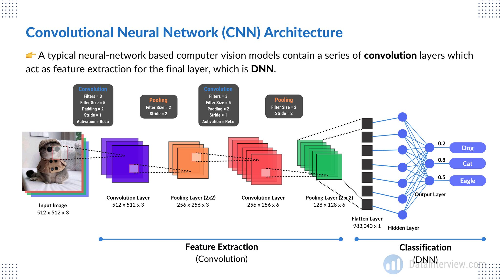

# Best Practices for Computer Vision: Data Preprocessing, Model Selection, and Hyperparameter Tuning

 With the wealth of tools and techniques at our disposal today, achieving outstanding results in computer vision is not only possible but also achievable with the right practices and strategies. In this article, I will share some of the best practices for data preprocessing, model selection, hyperparameter tuning, and fine-tuning in the context of computer vision tasks.

 ## Understanding how Computer Vision Models work is not as complicated as you may imagine. 

 📕 𝗗𝗮𝘁𝗮
 
🔹 𝗜𝗺𝗮𝗴𝗲 𝗗𝗮𝘁𝗮 - An image is just Height x Width pixels in the range: 0 to 255.

🔹 𝗗𝗮𝘁𝗮 𝗔𝘂𝗴𝗺𝗲𝗻𝘁𝗮𝘁𝗶𝗼𝗻 - Rotation, gaussian blur, stretching, shifting

📘 𝗖𝗼𝗿𝗲 𝗖𝗼𝗺𝗽𝗼𝗻𝗲𝗻𝘁𝘀

🔹 𝗖𝗼𝗻𝘃𝗼𝗹𝘂𝘁𝗶𝗼𝗻 𝗟𝗮𝘆𝗲𝗿 - Filters that extract features (e.g. edges, corners)

🔹 𝗣𝗼𝗼𝗹𝗶𝗻𝗴 𝗟𝗮𝘆𝗲𝗿 - Downsampling of feature data using max(pixels)

🔹 𝗗𝗡𝗡 - Flatten feature H x W x C into tabular data then train a dense NN

📙 𝗔𝘂𝘅𝗶𝗹𝗶𝗮𝗿𝘆 𝗙𝘂𝗻𝗰𝘁𝗶𝗼𝗻

🔹 𝗡𝗼𝗿𝗺𝗮𝗹𝗶𝘇𝗮𝘁𝗶𝗼𝗻 - Helps vanishing/exploding gradient & convergence

🔹 𝗔𝗰𝘁𝗶𝘃𝗮𝘁𝗶𝗼𝗻 𝗙𝘂𝗻𝗰𝘁𝗶𝗼𝗻 - ReLu used often, introduces non-linearity 

🔹 𝗘𝘃𝗮𝗹𝘂𝗮𝘁𝗶𝗼𝗻 𝗠𝗲𝘁𝗿𝗶𝗰 - Cross-entropy used and errors propagated backwards

 It's not as complicated as you would imagine once you understand the building blocks.

 


## Folder Directory
```

├── LICENSE
├── README.md                <- Brief documentation
│
├── basic_neural_networks     <- Folder for Basic Neural Networks section
│   └── README.md             <- see folders (1 to 8) for details
│
├── data_processing           <- Folder for Data Processing section
│   └── README.md             <- see folders (1 to 4) for details
│
├── model_selection           <- Folder for Model Selection section
│   └── README.md             <- see folders (1 to 4) for details
│
├── hyperparameter_tuning     <- Folder for Hyperparameter Tuning section
│   └── README.md             <- see folders (1 to 4) for details
│
├── fine_tuning               <- Folder for Fine Tuning section
│   └── README.md             <- see folders (1 to 3) for details
│
├── computer_vision           <- Folder for Computer Vision Topics
│   └── README.md             <- Brief introduction to computer vision topics
│
│   ├── object_detection      <- Subfolder for Object Detection
│   │   └── README.md         <- Details on object detection topics
│
│   ├── image_segmentation    <- Subfolder for Image Segmentation
│   │   └── README.md         <- Details on image segmentation topics
│
│   ├── yolo_faster_rcnn      <- Subfolder for YOLO and Faster R-CNN
│   │   └── README.md         <- Details on YOLO and Faster R-CNN
│
│   ├── image_captioning      <- Subfolder for Image Captioning and Generation
│   │   └── README.md         <- Details on image captioning and generative models
│
│   ├── object_tracking       <- Subfolder for Object Tracking
│   │   └── README.md         <- Details on object tracking methods
│
│   ├── data_augmentation     <- Subfolder for Data Augmentation in Computer Vision
│   │   └── README.md         <- Details on data augmentation techniques
│
│   ├── hardware_acceleration <- Subfolder for Hardware Acceleration in Computer Vision
│   │   └── README.md         <- Details on hardware acceleration options
│
│   ├── advanced_applications <- Subfolder for Advanced Computer Vision Applications
│   │   └── README.md         <- Details on more complex applications
│
│   ├── ethics_in_cv         <- Subfolder for Ethical Considerations in Computer Vision
│   │   └── README.md         <- Details on ethical issues in computer vision
│
│   ├── deployment_scaling   <- Subfolder for Deployment and Scalability in Computer Vision
│   │   └── README.md         <- Details on deploying and scaling computer vision models
│
│   ├── industry_use_cases    <- Subfolder for Industry-Specific Use Cases in Computer Vision
│       └── README.md         <- Details on industry-specific applications


```


## Data Preprocessing

### 1. Data Augmentation
Data augmentation is a powerful technique to enhance the size and quality of your dataset. Apply transformations such as rotations, flips, zooms, and crops to increase the variability of your training data.

### 2. Normalization
Standardizing image data by scaling pixel values to a consistent range (e.g., [0, 1] or [-1, 1]). This ensures that the neural network converges faster and is less sensitive to input variations.

### 3. Handling Imbalanced Data
Addressing class imbalance by oversampling, undersampling, or using techniques like Synthetic Minority Over-sampling Technique (SMOTE) to balance class distributions.

### 4. Pretrained Models
Leveraging pretrained models such as VGG, ResNet, or Inception, and fine-tune them on your specific task. Transfer learning often leads to improved performance and faster convergence.

## Model Selection

### 1. Convolutional Neural Networks (CNNs)
For most computer vision tasks, CNNs are the go-to choice due to their exceptional feature extraction capabilities. Experiment with different architectures, including deeper and more specialized networks.

### 2. Architectural Choices
Considering the specific architecture that suits your task best. For image classification, architectures like ResNet, DenseNet, and EfficientNet are popular. For object detection, models like YOLO and Faster R-CNN are strong contenders.

### 3. Objectives
Choosing appropriate loss functions for your task. For instance, use cross-entropy loss for classification, mean squared error for regression, and Intersection over Union (IoU) for object detection.

### 4. Regularization
Preventing overfitting with techniques like dropout, weight decay, and batch normalization. Experiment with various dropout rates and weight decay values for optimal results.

## Hyperparameter Tuning

### 1. Learning Rate
The learning rate is a critical hyperparameter. Use learning rate schedules, such as learning rate annealing, to adapt the learning rate during training.

### 2. Batch Size
Optimal batch size depends on your dataset and available hardware. Smaller batches can result in better convergence, while larger batches can make better use of parallelism.

### 3. Optimizers
Experimenting with optimizers like Adam, SGD, or RMSprop. Their performance can vary depending on the dataset and model architecture.

### 4. Cross-Validation
Using cross-validation to evaluate model performance. It helps identify the best hyperparameters while providing a more robust estimate of model performance.

## Fine-Tuning

### 1. Feature Extraction
When fine-tuning pretrained models, consider freezing early layers (feature extraction) and only training the later layers on your task-specific data. This can speed up training and prevent overfitting.

### 2. Early Stopping
Implementing early stopping based on a validation metric. This prevents overfitting and saves training time.

### 3. Regularization
Applying regularization techniques during fine-tuning as well. These can help fine-tuned models generalize better.

## Conclusion

These best practices encompass the essence of successful computer vision projects. Remember that no one-size-fits-all solution exists, and experimentation is key. Understanding the nuances of your specific task and dataset is crucial. By following these guidelines and continuously refining your approach, you can harness the full potential of deep learning in computer vision.


Happy coding and visioning!


# Reference


1. **Basic Neural Networks**:
   - [Neural Networks and Deep Learning by Michael Nielsen](http://neuralnetworksanddeeplearning.com/)
   - [Deep Learning Specialization by Andrew Ng on Coursera](https://www.coursera.org/specializations/deep-learning)

2. **Data Processing**:
   - [Python Data Science Handbook by Jake VanderPlas](https://jakevdp.github.io/PythonDataScienceHandbook/)
   - [Pandas Documentation](https://pandas.pydata.org/pandas-docs/stable/)

3. **Model Selection**:
   - [Scikit-learn Documentation on Model Selection](https://scikit-learn.org/stable/model_selection.html)

4. **Hyperparameter Tuning**:
   - [Hyperparameter Tuning in Machine Learning Models](https://towardsdatascience.com/hyperparameter-tuning-c5619e7e6624)

5. **Fine Tuning**:
   - [Transfer Learning and Fine-Tuning with Keras](https://keras.io/guides/transfer_learning/)

6. **Deep Learning and Neural Network Architectures**:
   - [Deep Learning Specialization by Andrew Ng on Coursera](https://www.coursera.org/specializations/deep-learning)
   - [Stanford CS231n: Convolutional Neural Networks for Visual Recognition](http://cs231n.stanford.edu/)

7. **Backpropagation**:
   - [Backpropagation Algorithm on Wikipedia](https://en.wikipedia.org/wiki/Backpropagation)

8. **Overfitting and Regularization**:
   - [Regularization in Machine Learning](https://towardsdatascience.com/regularization-in-machine-learning-76441ddcf99a)


